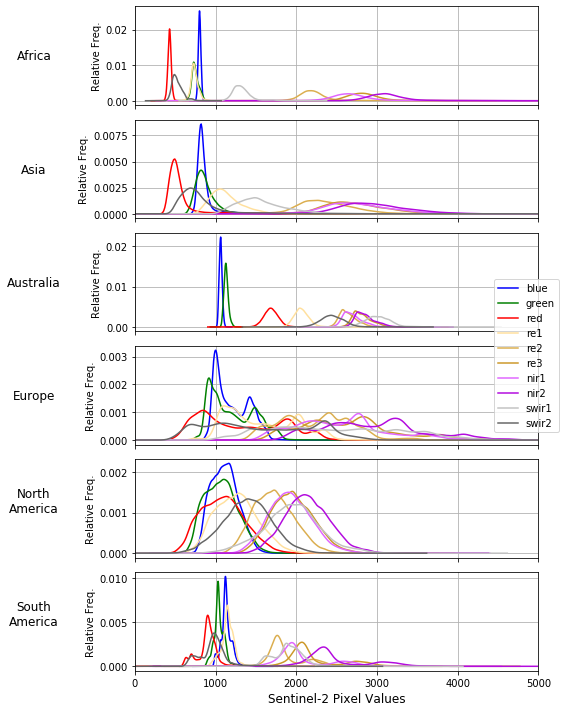
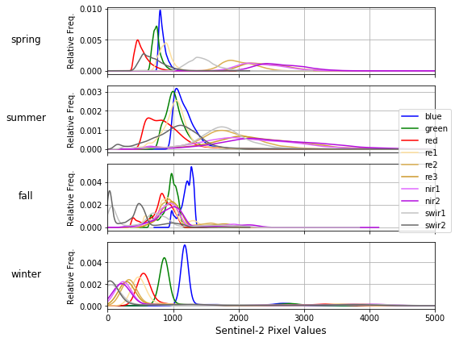

# land-cover
Deep learning for land cover classification

### Setup Instructions
1. `git clone` this repository
2. `cd` into root of this repository
3. `pip install -r requirements.txt`
4. `git clone https://github.com/kobiso/CBAM-keras`
5. `git clone https://github.com/titu1994/DenseNet`
6. Download and extract SEN12MS dataset: https://arxiv.org/abs/1906.07789
7. Edit dataset paths in `config.json`
8. Run `one_time_scripts/save_segmentation_patches_to_npy.py` to preprocess dataset

### Usage Instructions
* Train models: `python classify.py -c config.json --train`
* Generate predictions: `python classify.py -c config.json --predict`

### Sentinel-2 Band Distributions (By Continent)

### Sentinel-2 Band Distributions (By Season)

